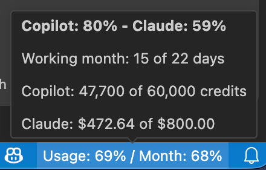

# Month AI Usage

A VS Code extension that shows, permanently in the status bar, how much of your monthly AI
credits you have used (GitHub Copilot and Claude) next to how much of the **working month**
has already gone by. The item turns amber when the average reaches 80 % or any single provider
reaches 90 %, and red when either the average or a single provider reaches 95 %.



## How it works

- **GitHub Copilot** – reads your AI credits quota through the same internal GitHub endpoint the
  Copilot extension uses, authenticated with your GitHub session in VS Code.
- **Claude** – reads your monthly spend and spend limit from claude.ai, authenticated with your
  claude.ai `sessionKey` cookie, which is stored in VS Code's secret storage.

Both sources are **unofficial internal APIs** and may change without notice. When one fails
the extension shows the other and reports the problem in the tooltip.

## Settings

| Setting | Default | What it does |
| --- | --- | --- |
| `monthAiUsage.refreshIntervalMinutes` | `15` | How often the data is refreshed. |
| `monthAiUsage.workingDays` | `[1,2,3,4,5]` | Days counted as working days, `0` = Sunday. |
| `monthAiUsage.warningThresholdPercent` | `80` | Average usage at which the item turns amber. |
| `monthAiUsage.errorThresholdPercent` | `95` | Average usage at which the item turns red. |
| `monthAiUsage.providerWarningThresholdPercent` | `90` | Usage of a single provider that turns the item amber on its own. |
| `monthAiUsage.providerErrorThresholdPercent` | `95` | Usage of a single provider that turns the item red on its own. |
| `monthAiUsage.copilot.enabled` | `true` | Track GitHub Copilot. |
| `monthAiUsage.claude.enabled` | `true` | Track Claude. |
| `monthAiUsage.claude.organizationId` | `""` | claude.ai organization uuid; empty auto-detects. |
| `monthAiUsage.claude.monthlyLimitUsd` | `0` | Overrides the limit read from claude.ai. |

## Development

```bash
npm install
npm run watch      # rebuild on change
# press F5 in VS Code to launch the Extension Development Host
npm test
```

## License

MIT
